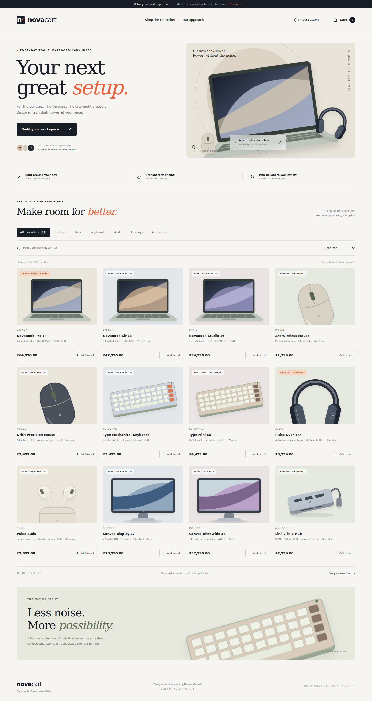
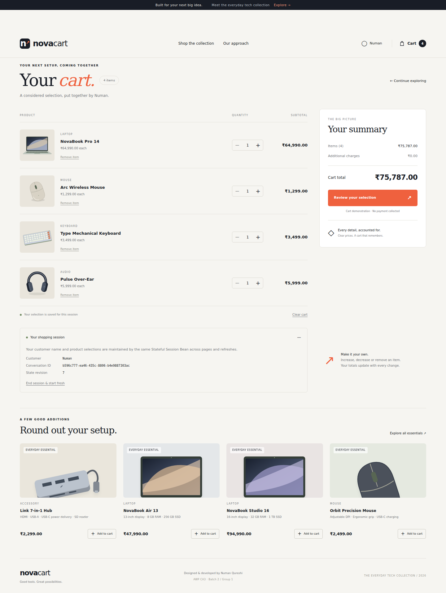

# NovaCart — Stateful EJB Shopping Cart

A responsive shopping-cart application built with **Java 17, Jakarta EE 10, and a real container-managed Stateful Session Bean**. NovaCart combines a 12-product technology catalog with a dedicated cart page, live item counts, quantity controls, and customer-specific conversational state.

Developed by **Numan Qureshi** for **Advanced Web Programming CA3 — Batch 2, Group 1**.

**[Open the live application](https://novacart-ejb.onrender.com/novacart/)** · **[Open the live cart](https://novacart-ejb.onrender.com/novacart/cart.html)** · **[Lab report](docs/NovaCart_Lab_Report.pdf)** · **[Viva preparation](docs/VIVA.md)**

> The Render deployment uses a free web-service instance. After 15 minutes without inbound traffic, the service can sleep. Opening the link starts it again; allow a few minutes for Java and Payara startup. Existing cart sessions are lost when the service sleeps or restarts. Open the application about five minutes before a classroom demonstration.

## Preview

### Storefront



### Dedicated cart page



## Assignment requirements

The application implements all seven requirements for the PDF's **Batch 2, Group 1: Shopping Cart** task.

| Requirement | Implementation |
|---|---|
| Accept Customer Name | Customer form validates and stores the name in `ShoppingCartBean` |
| Add Laptop, Mouse, and Keyboard | All three required product types are present in the server-owned catalog |
| Maintain selections across multiple operations | The same Stateful EJB retains the customer's product quantities |
| Add, View, Remove, and Clear | Implemented as bean methods and accessible through the interface |
| Use `@Stateful` | `ShoppingCartBean` is annotated with `jakarta.ejb.Stateful` |
| Display current cart contents | Separate cart page displays products, quantities, subtotals, and total |
| Demonstrate maintained state | Refresh retention, navigation between pages, and customer isolation are verified |

The report includes the required **17 sections**: Title, Aim, Problem Statement, Objectives, Software Requirements, Introduction to Stateful Session Bean, Why Stateful Bean Is Used, Architecture/Application Flow, Stateful Bean Class Structure, Algorithm/Program Steps, Source Code, Input, Output, Explanation of Important Code, Test Cases, Result, and Conclusion. It also explains Stateful versus Stateless beans and the state maintained by the application.

## Features

- **12 products across six categories:** Laptop, Mouse, Keyboard, Audio, Display, and Accessory.
- Responsive storefront with custom SVG product artwork and a charcoal/orange visual theme.
- Search, category filters, sorting by price or name, and product quick-view dialogs.
- Customer-name form and editable customer display name.
- Sticky header with a live cart count. The count represents **total units**, not distinct product lines.
- Dedicated `cart.html` page with quantity increase/decrease, per-line subtotal, and live total updates.
- Repeat additions increase the quantity of an existing product line.
- Quantity range of **1–10 units per product**; remove deletes the complete line.
- Clear Cart empties selections while keeping the customer conversation.
- Cart recommendations, empty states, toast feedback, and a selection-review dialog.
- Expandable session panel showing customer name, conversation ID, and state revision.
- Explicit End Session action to destroy the previous conversation and start fresh.
- Independent carts for separate browser sessions.

## Technology stack

| Layer | Technology |
|---|---|
| Language | Java 17 |
| Enterprise platform | Jakarta EE 10 / Enterprise Beans 4.0 |
| Business component | Stateful EJB, `@Stateful`, `@StatefulTimeout`, `@Remove` |
| HTTP layer | Jakarta Servlet and Jakarta JSON Processing |
| Application server | Payara Micro 6.2025.1 |
| Frontend | HTML, CSS, vanilla JavaScript, custom SVG artwork |
| Build | Apache Maven 3.9+; WAR packaging |
| Unit tests | JUnit Jupiter 5.11.4 |
| Integration tests | Python standard library, against a running Payara server |
| Cloud runtime | Docker on Render, Singapore region |
| Optional routing | Vercel reverse-proxy configuration; deployment pending |

**An EJB-capable application server is required. Plain Tomcat alone does not provide the EJB container this project needs.**

## Architecture and state management

The request flow is:

**Browser → CartServlet → session-specific EJB proxy → ShoppingCartBean → immutable CartSnapshot → JSON response → interface**

`CartServlet` is shared across requests. On the first request for a browser session, it performs a JNDI lookup of `java:module/ShoppingCartBean` to obtain a new container-managed Stateful EJB. It retains that proxy in the browser's `HttpSession`.

The servlet does not store all customers' selections in one shared bean field. Each browser session receives its own EJB conversation.

| Component | Responsibility |
|---|---|
| `ShoppingCartBean` | Owns customer name, product quantities, conversation ID, and revision |
| `CartServlet` | Looks up the EJB, routes operations, validates CSRF, and creates JSON responses |
| `Catalog` | Defines accepted product IDs and server-owned sample prices |
| `Product`, `CartLine`, `CartSnapshot` | Represent catalog entries, line items, and immutable cart snapshots |
| `CartValidationException` | Reports expected validation failures without discarding the EJB |
| `SessionCleanup` | Calls the bean's removal method when an HTTP session is destroyed |
| `assets/app.js` | Renders the storefront/cart and sends same-origin API requests |
| `assets/artwork.js` | Supplies locally authored SVG product illustrations |

### What the bean remembers

- `customerName`: the customer's display name.
- `quantities`: a private `LinkedHashMap` of product IDs and quantities.
- `conversationId`: a UUID identifying the current bean conversation.
- `revision`: a counter incremented by successful state changes.

`add()` updates the existing quantity map. `viewCart()` reads that stored map and creates an immutable snapshot. Navigating to the cart page or refreshing uses the same bean proxy while the session remains valid.

### Session lifecycle

- HTTP session idle timeout: **30 minutes**.
- Stateful EJB idle timeout: **35 minutes**.
- `clear()` empties product selections but preserves the customer and conversation ID.
- End Session invalidates the HTTP session; the cleanup listener invokes `close()`, annotated with `@Remove`.
- A later request creates a new conversation.
- A timeout, restart, redeployment, or Render idle suspension can end the existing cart.
- The cloud deployment uses one Payara instance. Multi-instance session replication is not configured.

The bean implements `Serializable`. Serialization is unit-tested; forced container passivation and clustered failover have not been verified.

## Product catalog

Prices are sample INR values, maintained by the server.

| Product ID | Product | Category | Price |
|---|---|---|---:|
| `laptop` | NovaBook Pro 14 | Laptop | ₹64,990.00 |
| `laptop-air` | NovaBook Air 13 | Laptop | ₹47,990.00 |
| `laptop-studio` | NovaBook Studio 16 | Laptop | ₹94,990.00 |
| `mouse` | Arc Wireless Mouse | Mouse | ₹1,299.00 |
| `mouse-pro` | Orbit Precision Mouse | Mouse | ₹2,499.00 |
| `keyboard` | Type Mechanical Keyboard | Keyboard | ₹3,499.00 |
| `keyboard-mini` | Type Mini 65 | Keyboard | ₹4,499.00 |
| `headphones` | Pulse Over-Ear | Audio | ₹5,999.00 |
| `earbuds` | Pulse Buds | Audio | ₹2,999.00 |
| `monitor` | Canvas Display 27 | Display | ₹18,990.00 |
| `monitor-wide` | Canvas UltraWide 34 | Display | ₹32,990.00 |
| `hub` | Link 7-in-1 Hub | Accessory | ₹2,299.00 |

## Run locally

### Requirements

- JDK **17**, with Java available on `PATH`.
- Maven **3.9+** to build from source or rebuild after editing.
- Internet for initial dependency/runtime downloads.
- Port **8080** available.
- Linux/macOS launcher: Python 3 and `curl`.

A prebuilt `target/novacart.war` is included in the repository/package. The launchers build only when that WAR is missing. **After changing source code, rebuild explicitly before launching.**

### Windows PowerShell

Clone the repository and enter its root:

```powershell
git clone https://github.com/TDMNQS/novacart-ejb.git
cd novacart-ejb
java -version
powershell -ExecutionPolicy Bypass -File .\run.ps1
```

If using the downloaded project ZIP, open PowerShell in the inner **`novacart`** folder containing `run.ps1` instead.

The Windows launcher automatically prefers a Microsoft JDK 17 installation when available and checks the Java version before startup. If Java 17 is missing, install it and reopen the terminal:

```powershell
winget install --id Microsoft.OpenJDK.17 --exact
```

### Linux / macOS

```bash
git clone https://github.com/TDMNQS/novacart-ejb.git
cd novacart-ejb
java -version
bash run.sh
```

The Linux/macOS launcher expects Java 17 to be selected; it does not automatically switch JDKs.

### Open the application

After Payara reports that deployment is ready, open:

- Storefront: **http://localhost:8080/novacart/**
- Cart: **http://localhost:8080/novacart/cart.html**

Keep the server terminal running. Press **Ctrl+C** to stop it.

Both launchers download pinned Payara Micro 6.2025.1 into `.runtime/` on first use and verify its SHA-256. Later runs reuse the downloaded runtime.

### Build and rebuild

```bash
mvn clean verify
```

This compiles the source, runs unit tests, and produces `target/novacart.war`. Stop the running server, rebuild, and launch again after editing. Refresh the browser with **Ctrl+F5** to load updated frontend assets.

To use another port after the runtime has been downloaded:

```bash
java -jar .runtime/payara-micro.jar --noCluster --port 8081 --deploy target/novacart.war --contextroot novacart
```

Then open **http://localhost:8081/novacart/**.

## API reference

Local endpoint: **`http://localhost:8080/novacart/api/cart`**

Live endpoint: **`https://novacart-ejb.onrender.com/novacart/api/cart`**

### Read the cart

`GET /novacart/api/cart` creates or resumes the browser session and returns:

| Field | Meaning |
|---|---|
| `customerName` | Current display name |
| `conversationId` | Current EJB conversation UUID |
| `revision` | Successful state-change count |
| `items` | Selected products with quantities and subtotals |
| `itemCount` | Total units across all selected products |
| `total` | Server-calculated cart total |
| `catalog` | Available products and sample prices |
| `csrfToken` | Session token required for POST operations |

### Change the cart

Send `POST /novacart/api/cart` with:

- `Content-Type: application/x-www-form-urlencoded`
- `X-CSRF-Token: <token from GET>`
- The same session cookie received from GET.

| Action | Form parameters | Behavior |
|---|---|---|
| `customer` | `action=customer&name=Numan` | Set or update the customer display name |
| `add` | `action=add&id=mouse` | Add one unit |
| `quantity` | `action=quantity&id=mouse&quantity=2` | Set a selected product's quantity, from 1 to 10 |
| `remove` | `action=remove&id=mouse` | Remove the complete product line |
| `clear` | `action=clear` | Empty the cart while retaining the conversation |
| `end` | `action=end` | Invalidate the session; returns `{"ended":true}` |

Most successful POST operations return the updated snapshot. Unknown actions, invalid names, invalid product IDs, and invalid quantities return **400**. Missing/incorrect CSRF tokens return **403**. An expired EJB can return **409**; reload to start a new session. Unexpected server failures return **500**.

To test using Postman, first send GET, keep its cookie, copy `csrfToken`, and then send a form-urlencoded POST with that token header.

## Validation and security measures

- Customer name: 1–60 characters after trimming; control characters are rejected.
- Only product IDs in the server catalog are accepted.
- Product quantities must be whole numbers from 1 through 10.
- The server owns prices and calculates currency using `BigDecimal`.
- Session cookies are `HttpOnly`; cookie-based session tracking is configured.
- Every mutation requires the session's CSRF token.
- API responses use `Cache-Control: no-store` and `X-Content-Type-Options: nosniff`.
- Same-session operations are serialized using `synchronized(session)`.
- Customer text is rendered through `textContent` rather than inserted as HTML.
- Expected validation errors use `@ApplicationException(rollback=false)` to preserve the EJB conversation.
- The Docker runtime runs as an unprivileged user and verifies the Payara JAR checksum.

These measures support the academic demo; they do not constitute a complete production security assessment. A customer name is a display name, not authenticated identity.

## Tests and verification

### Unit tests

```bash
mvn clean verify
```

**13 JUnit tests** cover business rules, exact totals, repeated additions, removal, clearing, isolated bean instances, validation, immutable snapshots, the expanded catalog, and serialization.

### Real Payara integration tests

Start the server in one terminal. In another terminal, from the repository root:

```bash
python tests/integration.py
```

On Linux/macOS, use `python3` if needed. To use another local port:

```bash
python3 tests/integration.py http://localhost:8081/novacart/api/cart
```

The Python test client disables environment proxies, which is appropriate for local testing. Cloud verification may need the test client's network/proxy configuration adjusted for the execution environment.

**23 integration checks** verify genuine container-managed conversations, required products, customer isolation, state retention, quantity operations, remove/clear/end behavior, CSRF rejection, and validation without losing the bean.

Unit tests instantiate the bean directly and do not prove EJB container behavior. Integration tests invoke the real EJB through the servlet on Payara.

### Recorded verification

- Maven build and all **13 unit tests** passed.
- All **23 real Payara HTTP/EJB integration checks** passed locally and on the Render deployment.
- Live Chromium verification covered 12 products, customer-name entry, add-to-cart, live header counts, cart navigation, quantity increase/decrease, refresh retention, mobile width, and absence of JavaScript errors.
- Additional local browser checks covered search, filtering, sorting, product details, review, removal, clearing, and desktop/mobile presentation.

Cloud verification was completed on **9 October 2026 (IST)**. See [verification notes](docs/VERIFICATION.md) for the original local results. This records completed checks; it is not a guarantee of uninterrupted future uptime.

## Cloud deployment

### Render — deployed

**Live application: https://novacart-ejb.onrender.com/novacart/**

- Git repository: `TDMNQS/novacart-ejb`, branch `main`.
- Service: `novacart-ejb`, Singapore region, free Docker web service.
- `Dockerfile` builds the WAR from source and runs the unit tests.
- Runtime: Java 17 and pinned Payara Micro 6.2025.1.
- `cloud-start.sh` starts Payara on Render's `PORT` with `/novacart` as the context root.
- `--noCluster` is used for the single-instance deployment.
- Java memory settings: `-Xms64m`, `-Xmx256m`, and `-XX:MaxMetaspaceSize=160m`.
- A suitable application health-check path is `/novacart/index.html`.

Render's free web services can spin down after 15 minutes without inbound traffic. The workspace shares 750 free instance hours per calendar month across its free web services. Reaching usage limits can suspend services. Read [Render's current free-service documentation](https://render.com/docs/free).

The application code is retained in GitHub and the deployed image. Cart contents live in process memory and are lost on service restart, redeployment, or idle suspension.

### Vercel — configuration ready, deployment pending

`vercel.json` configures a static entry directory and an external rewrite to Render:

- `/` redirects to `/novacart/`.
- `/novacart/:path*` proxies to `https://novacart-ejb.onrender.com/novacart/:path*`.
- API routes specify private, non-cacheable responses.

This keeps the browser-facing pages and API on the same origin while Payara handles the Stateful EJB. The Java backend remains on Render. Vercel does not remove Render's idle suspension or cold-start behavior.

**No Vercel live URL is available yet.** Deployment is pending access to the connected Vercel team/workspace. If importing manually, use the repository root and the committed configuration; do not select the WAR as a static output directory. Validate session cookies, POST requests, and cart retention after deployment.

For additional deployment notes, see [Cloud Deployment](docs/CLOUD_DEPLOYMENT.md).

## Repository guide

| Path | Contents |
|---|---|
| `src/main/java/com/numan/novacart/` | EJB, servlet, catalog, models, validation, and cleanup listener |
| `src/main/webapp/index.html` | Storefront |
| `src/main/webapp/cart.html` | Dedicated cart page |
| `src/main/webapp/assets/` | JavaScript, CSS, and SVG artwork definitions |
| `src/main/webapp/WEB-INF/web.xml` | HTTP session and cookie configuration |
| `src/test/java/com/numan/novacart/` | Business-logic unit tests |
| `tests/integration.py` | HTTP/EJB integration checks |
| `docs/` | Lab report, screenshots, verification notes, viva, and deployment notes |
| `pom.xml` | Maven dependencies and WAR build |
| `run.ps1`, `run.sh` | Local launchers |
| `Dockerfile`, `.dockerignore`, `cloud-start.sh` | Render container build and startup |
| `vercel.json`, `vercel-public/` | Optional Vercel proxy configuration |
| `target/novacart.war` | Included prebuilt deployment archive |
| `START_HERE.txt` | Quick-start and upgrade notes |

## Five-minute classroom demonstration

1. Open the storefront and add **NovaBook Pro 14**. Enter **Numan** when prompted.
2. Add **Arc Wireless Mouse** and **Type Mechanical Keyboard**. The header count becomes **3**, and the total is **₹69,788.00**.
3. Open Cart from the header. Refresh and show that the customer, products, and conversation ID remain.
4. Increase Mouse to quantity 2. The count becomes **4** and the total becomes **₹71,087.00**.
5. Remove Keyboard. The total becomes **₹67,588.00**.
6. Open a private/incognito browser, enter **Furqan**, and demonstrate an independent empty cart with a different conversation ID.
7. Clear Numan's cart. Show that the products disappear while the customer name and conversation ID remain.
8. Expand Your Shopping Session and use End Session. The next conversation has a new ID.

## Troubleshooting

| Problem | Action |
|---|---|
| `run.ps1` does not exist | Enter the folder containing the script: repository root after cloning, or inner `novacart` folder after extracting the ZIP |
| Unsupported JDK warning or Payara bootstrap failure | Select JDK 17 and restart; check `java -version` |
| `mvn` is not recognized | Install Maven 3.9+ and reopen the terminal |
| Runtime checksum mismatch | Delete `.runtime/payara-micro.jar` and rerun the launcher |
| Port 8080 is occupied | Stop the other process or launch on port 8081 |
| Old design or source changes not visible | Stop Payara, run `mvn clean verify`, restart, then use Ctrl+F5 |
| Products do not load | Confirm Payara finished deploying; inspect the server log and `/novacart/api/cart` |
| Session/CSRF error | Reload the page to obtain the current session token |
| Render loading screen or temporary 404 during startup | Wait for Payara and WAR deployment to finish, then reload |
| Cart disappears after inactivity or restart | Begin a new session; carts are intentionally stored in memory |
| Firewall prompt on Windows | Localhost demonstration does not require exposing the app to public networks; only allow access appropriate to your intended network use |

## Scope and limitations

NovaCart is an **academic shopping-cart demonstration**. It provides selection review, not an order-placement or payment workflow.

There is no authentication, database, payment gateway, inventory reservation, order processing, or durable cart recovery. Prices and specifications are sample catalog data. These commerce features are not required by this assignment.

For production use, further work would include authenticated accounts, persistent cart/order storage, inventory control, payment integration, hardened session/cookie configuration, operational monitoring, recovery procedures, accessibility review, and load/security testing. Paid hosting avoids the free plan's idle suspension but does not by itself make in-memory carts durable across restarts.

## Author

**Numan Qureshi** · B.Tech Information Technology · MGM University

[GitHub profile](https://github.com/TDMNQS) · [Project repository](https://github.com/TDMNQS/novacart-ejb)
